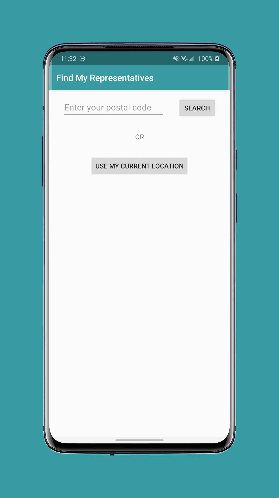
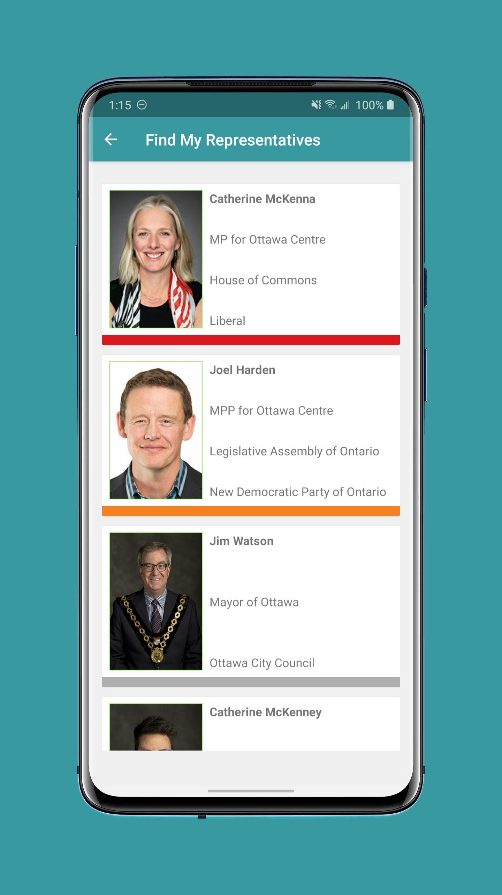

An Android app written in Kotlin that helps Canadians find their elected representatives, using only their postal code or their current device location.

 

Please see the [Wiki](https://github.com/OrenScheer/Find-My-Representatives/wiki) for more details.
